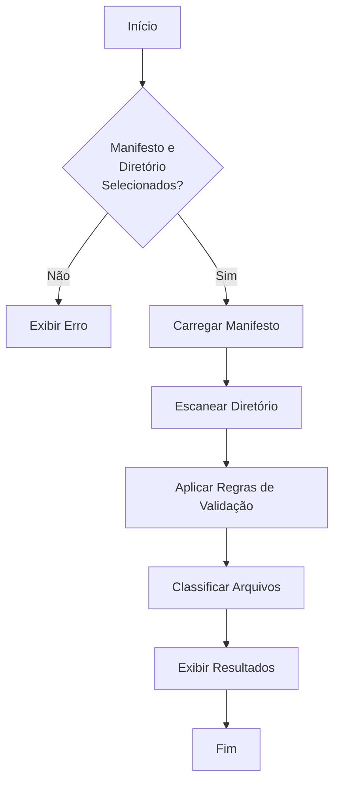
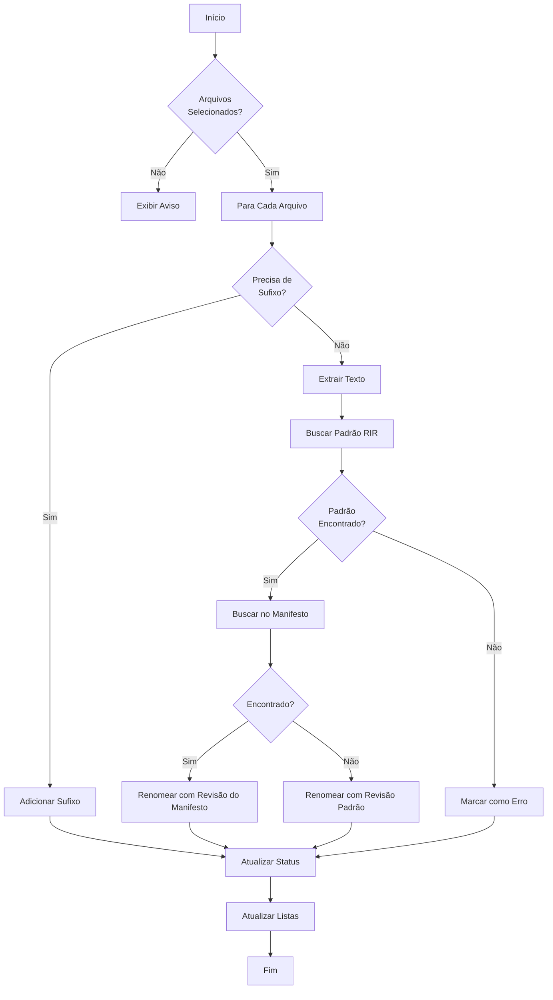
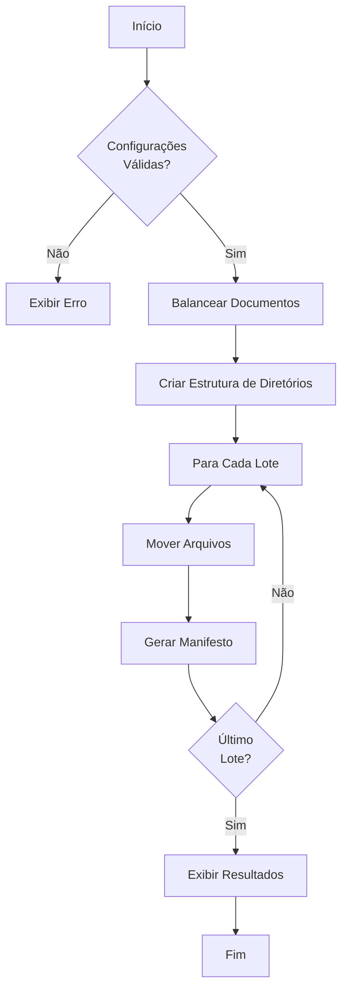

# SAD App v2.0 - Sistema de Automação de Documentos

<div align="center">
  
  
  
  
</div>

## 📋 Índice

- [Visão Geral](#-visão-geral)
- [Funcionalidades](#-funcionalidades)
- [Instalação](#-instalação)
- [Guia de Uso](#-guia-de-uso)
- [Arquitetura](#-arquitetura)
- [Fluxos de Trabalho](#-fluxos-de-trabalho)
- [Tratamento de Documentos](#-tratamento-de-documentos)
- [Regras de Negócio](#-regras-de-negócio)
- [Troubleshooting](#-troubleshooting)
- [Desenvolvimento](#-desenvolvimento)
- [Testes](#-testes)
- [Créditos](#-créditos)

## 🔍 Visão Geral

O **SAD App v2.0** é um sistema avançado de automação para processamento de documentos técnicos baseado em manifestos Excel. Desenvolvido seguindo os princípios da **Clean Architecture**, o sistema automatiza a validação, organização e geração de lotes documentais estruturados.

### Principais Benefícios

- ⚡ **Automatização Completa**: Reduza o tempo de processamento documental em até 80%
- � **Validação Precisa**: Identifique e corrija problemas em documentos automaticamente
- 📊 **Organização Inteligente**: Distribua documentos em lotes balanceados
- 🔄 **Processamento Assíncrono**: Interface responsiva mesmo durante operações pesadas
- 🛡️ **Operações Seguras**: Movimentação de arquivos com confirmação e validação
- 🖥️ **Interface Moderna**: Design intuitivo com tema escuro para maior conforto visual

### Compatibilidade

- **Sistema Operacional**: Windows 10/11 (testado), Linux, macOS
- **Requisitos**: Python 3.13+, 4GB RAM, 100MB espaço em disco
- **Tipos de Documentos**: PDF, DOC/DOCX, XLS/XLSX, JPG, PNG, TIF

## ✨ Funcionalidades

### Módulo de Validação

- **Carregamento de Manifesto**: Importação de listas de documentos esperados via Excel
- **Escaneamento de Diretório**: Identificação de arquivos compatíveis com filtro por padrão
- **Análise de Correspondência**: Casamento automático entre arquivos e itens do manifesto
- **Resolução RIR**: Processamento especial para documentos com formato RIR
- **Detecção de Sufixo**: Identificação de arquivos com nomes corretos mas sem sufixo de revisão
- **Correção Automática**: Aplicação de sufixo correto conforme o manifesto
- **Feedback Visual**: Exibição de status com indicadores visuais e logs detalhados

### Módulo de Organização

- **Balanceamento de Lotes**: Distribuição equilibrada de documentos entre lotes
- **Estrutura de Diretórios**: Criação automática de pastas organizadas por lote
- **Preenchimento de Templates**: Geração de manifestos Excel baseados em modelo mestre
- **Movimentação Segura**: Transferência de arquivos com validação de integridade
- **Configuração Flexível**: Ajuste de parâmetros de organização via interface
- **Rastreabilidade**: Registro detalhado de todas as operações realizadas

### Interface Gráfica

- **Design Moderno**: Interface construída com CustomTkinter e tema dark
- **Navegação por Abas**: Separação clara entre fluxos de validação e organização
- **Seleção de Arquivos**: Diálogos nativos para escolha de arquivos e diretórios
- **Exibição de Listas**: Visualização clara de arquivos validados e não reconhecidos
- **Sistema de Logs**: Registro detalhado de operações com feedback em tempo real
- **Barra de Progresso**: Indicação visual do andamento das operações
- **Seleção Múltipla**: Capacidade de selecionar vários arquivos para processamento
- **Copyright**: Informação de copyright visível no rodapé da aplicação

## 🚀 Instalação

### Pré-requisitos

- Python 3.13 ou superior
- 4GB de RAM mínimo recomendado
- 100MB de espaço em disco
- Permissões de leitura/escrita no sistema de arquivos

### Instalação Passo a Passo

#### 1. Configurar ambiente virtual

```powershell
# Windows PowerShell - Permitir execução de scripts (Administrador)
Set-ExecutionPolicy -ExecutionPolicy RemoteSigned -Scope CurrentUser

# Criar ambiente virtual
python -m venv .venv

# Ativar ambiente virtual (Windows PowerShell)
.venv\Scripts\Activate.ps1
# OU (Windows CMD)
# .venv\Scripts\activate.bat
# OU (Linux/macOS)
# source .venv/bin/activate
```

#### 2. Instalar dependências

```powershell
pip install -r requirements.txt
# OU instalar pacotes principais diretamente
pip install customtkinter==5.2.2 openpyxl==3.1.2 pytest==8.1.1 ruff==0.1.9
```

#### 3. Executar a aplicação

```powershell
# Certifique-se de que o ambiente virtual está ativado
python run.py
```

> 💡 **Importante**: Se encontrar erro de "execução de scripts desabilitada", veja a seção [Troubleshooting](#-troubleshooting)

### Instalação da Versão Executável

Para usuários sem Python instalado, existe uma versão executável standalone:

1. Baixe o arquivo `SAD_App_v2_Launcher.exe`
2. Execute o launcher que extrairá automaticamente os arquivos necessários
3. A aplicação será iniciada após a extração

## 📖 Guia de Uso

### Fluxo Completo de Trabalho

#### 1. Validação de Lote

1. **Inicie a aplicação**: Execute `python run.py`
2. **Selecione o Manifesto**: Clique no botão "Selecionar..." para o "Manifesto de Entrada"
   - O manifesto deve ser um arquivo Excel com a estrutura especificada em [Formato do Manifesto](#formato-do-manifesto)
3. **Escolha a Pasta de Origem**: Selecione o diretório que contém os documentos a serem processados
4. **Clique em "VALIDAR LOTE"**: Inicie o processo de validação
5. **Acompanhe o Processo**:
   - A área de logs mostrará o andamento da operação
   - A barra de progresso indicará a porcentagem concluída
6. **Visualize os Resultados**:
   - **Lista "Validados"**: Documentos encontrados com correspondência no manifesto
   - **Lista "Não Reconhecidos"**: Documentos sem correspondência ou que precisam de intervenção

#### 2. Resolução de Documentos Não Reconhecidos

1. **Selecione os Documentos**: Marque as caixas de seleção dos documentos não reconhecidos que deseja resolver
   - Use o botão "Selecionar Todos" para marcar todos os documentos na lista
2. **Clique em "Resolver Selecionados"**: Inicia o processo de resolução automática
   - O sistema usa o método RIR para analisar e resolver os documentos
   - Documentos com nomes corretos mas sem sufixo serão corrigidos automaticamente
3. **Acompanhe a Resolução**:
   - A resolução ocorre individualmente para cada arquivo selecionado
   - O log mostrará detalhes sobre a extração de texto e correspondência
4. **Confirme os Resultados**:
   - Documentos resolvidos serão movidos para a lista de validados
   - Documentos ainda não reconhecidos permanecerão na lista original

#### 3. Organização em Lotes

1. **Acesse a Aba "Organização"**: Clique na guia superior "Organização"
2. **Configure os Parâmetros**:
   - **Pasta de Destino**: Local onde os lotes serão criados
   - **Template Master**: Arquivo Excel que servirá como modelo para os manifestos gerados
   - **Máx. Documentos por Lote**: Limite de documentos para cada lote gerado
   - **Padrão Nome do Lote**: Formato para nomear os lotes (ex: `LOTE_{SEQ}`)
   - **Número de Sequência Inicial**: Valor inicial para numeração dos lotes
3. **Clique em "ORGANIZAR LOTES"**: Inicie o processo de organização
4. **Acompanhe a Organização**:
   - O log mostrará a criação de diretórios, cópia de arquivos e geração de manifestos
5. **Verifique os Resultados**:
   - Um diálogo informará o número de lotes criados e arquivos movidos
   - Os lotes estarão disponíveis no diretório de destino selecionado

### Formato do Manifesto

O arquivo Excel do manifesto deve conter as seguintes colunas:

| Coluna | Conteúdo | Descrição |
|--------|----------|-----------|
| A | Código do Documento | Identificador único do documento (ex: "RIR_DOCUMENTO_123") |
| B | Título | Nome descritivo do documento |
| C | Revisão | Número da revisão (será usado como sufixo, ex: "0") |
| D | Metadados | Informações adicionais (opcional) |

### Tratamento de Documentos Especiais

#### Arquivos com Nomes Corretos mas sem Sufixo

O sistema agora identifica automaticamente arquivos cujo nome base corresponde a um código de documento no manifesto, mas que estão sem o sufixo de revisão. Estes são marcados com o status `NEEDS_SUFFIX` e podem ser corrigidos automaticamente através da resolução RIR.

**Exemplo:**
- Arquivo: `RIR_DOCUMENTO_123.pdf`
- Item no manifesto: Código=`RIR_DOCUMENTO_123`, Revisão=`0`
- Resultado após correção: `RIR_DOCUMENTO_123_0.pdf`

## 🏗️ Arquitetura

A aplicação segue o padrão **Clean Architecture** com camadas bem definidas:

```
src/
├── sad_app_v2/
│   ├── core/                      # 🎯 Domain Layer
│   │   ├── domain.py              # Entidades e Value Objects
│   │   ├── interfaces.py          # Protocolos e Contratos
│   │   ├── exceptions.py          # Exceções do Domínio
│   │   └── use_cases/             # Casos de Uso
│   │       ├── validate_batch.py  # UC-01: Validar Lote
│   │       ├── resolve_exception.py # UC-02: Resolver Não Reconhecidos
│   │       └── organize_lots.py   # UC-03: Organizar em Lotes
│   ├── infrastructure/            # 🔧 Infrastructure Layer
│   │   ├── excel_reader.py        # Adaptador para Excel
│   │   ├── file_system.py         # Sistema de Arquivos Seguro
│   │   ├── template_filler.py     # Preenchimento de Templates
│   │   ├── services.py            # Serviços de Negócio
│   │   └── extraction.py          # Extração de Metadados
│   └── presentation/              # 🖥️ Presentation Layer
│       ├── main_view.py           # Interface Gráfica Completa
│       └── view_controller.py     # Controller MVC com Threading
├── main.py                        # 🎯 Entry Point Alternativo
└── run.py                         # 🚀 Ponto de Entrada Principal
```

## ✨ Funcionalidades

### UC-01: Validar Lote de Documentos
- ✅ Carrega manifesto de documentos (arquivo Excel)
- ✅ Varre diretório de origem em busca de arquivos
- ✅ Aplica regra de negócio RN-NEW-001 (remoção de sufixos temporários)
- ✅ Classifica arquivos como válidos ou não reconhecidos
- ✅ Exibe resultados em interface gráfica moderna

### UC-02: Resolver Arquivo Não Reconhecido
- ✅ Interface para seleção de arquivos não reconhecidos
- ✅ Aplicação de perfis de extração customizados
- ✅ Resolução automática baseada em padrões
- ✅ Atualização dinâmica das listas de arquivos

### UC-03: Organizar e Gerar Lotes
- ✅ Balanceamento inteligente de lotes por número de documentos
- ✅ Criação automática de estrutura de pastas organizadas
- ✅ Geração de templates Excel preenchidos com dados
- ✅ Movimentação segura de arquivos com validação

### Interface Gráfica Completa
- 🎨 Design moderno com CustomTkinter e tema dark
- 📋 Interface com abas (Validação + Organização)
- 📁 Seleção de manifesto, diretórios e templates via dialogs
- � Barra de progresso e feedback visual em tempo real
- 📝 Sistema de logs com timestamps e níveis de severidade
- 🔄 Processamento assíncrono com threading para UI responsiva
- ⚙️ Configuração completa de parâmetros de organização

### Qualidade de Código
- 🧪 **45 testes aprovados, 1 skipped** (98% de sucesso)
- 🔍 Testes unitários para todas as camadas
- 🌐 Testes de integração end-to-end
- 📏 Linting com Ruff e formatação automática
- 🎯 Type hints completos com Python 3.13
- 📖 Documentação abrangente com docstrings

## 🚀 Instalação e Execução

### Pré-requisitos
- Python 3.13+
- Windows (testado) / Linux / macOS

### Configuração do Ambiente Virtual
```bash
# Criar ambiente virtual
python -m venv .venv

# Ativar ambiente virtual (Windows PowerShell)
# OPÇÃO 1 - Permitir execução de scripts (Administrador):
Set-ExecutionPolicy -ExecutionPolicy RemoteSigned -Scope CurrentUser
.venv\Scripts\activate

# OPÇÃO 2 - Comando direto (sem alterar política):
.venv\Scripts\Activate.ps1

# OPÇÃO 3 - Usar Command Prompt (cmd):
.venv\Scripts\activate.bat

# Ativar ambiente virtual (Linux/macOS)
source .venv/bin/activate

# Instalar dependências
pip install customtkinter==5.2.2 openpyxl==3.1.2 pytest==8.1.1 ruff==0.1.9
```

### Executar a Aplicação
```bash
# IMPORTANTE: Ativar o ambiente virtual primeiro!

# Windows PowerShell (escolha uma opção):
.venv\Scripts\Activate.ps1        # Opção mais direta
# ou
.venv\Scripts\activate.bat        # Via Command Prompt

# Linux/macOS:
source .venv/bin/activate

# Executar interface gráfica
python run.py
```

### Executar Testes
```bash
# Executar todos os testes
python -m pytest -v

# Executar testes específicos
python -m pytest tests/unit/core/ -v
python -m pytest tests/integration/ -v
```

## 🔧 Troubleshooting

### Problema: "Execução de scripts foi desabilitada" (Windows)

**Erro:**
```
.venv\Scripts\activate : O arquivo não pode ser carregado porque a execução de scripts foi desabilitada neste sistema.
```

**Soluções:**

1. **Alterar política de execução (Recomendado):**
   ```powershell
   Set-ExecutionPolicy -ExecutionPolicy RemoteSigned -Scope CurrentUser
   .venv\Scripts\activate
   ```

2. **Usar comando direto:**
   ```powershell
   .venv\Scripts\Activate.ps1
   ```

3. **Usar Command Prompt (cmd):**
   ```cmd
   .venv\Scripts\activate.bat
   ```

### Problema: "ModuleNotFoundError: No module named 'sad_app_v2'"

**Solução:**
- Certifique-se de estar no diretório correto e usar `python run.py` (não `python main.py`)
- Verifique se o ambiente virtual está ativado

### Problema: Erro de interface gráfica

**Solução:**
- Instale/atualize o CustomTkinter: `pip install --upgrade customtkinter`
- Verifique se está executando em um ambiente com interface gráfica

## 📋 Como Usar

1. **Inicie a aplicação**: Execute `python run.py`

### Aba de Validação

2. **Selecione o Manifesto**: 
   - Clique em "Selecionar..." ao lado de "Manifesto de Entrada"
   - Escolha um arquivo Excel (.xlsx/.xls) com a estrutura:
     - Coluna A: Código SAP
     - Coluna B: Descrição
     - Coluna C: Total de Páginas
     - Coluna D: Caminho do Arquivo

3. **Selecione o Diretório**: 
   - Clique em "Selecionar..." ao lado de "Pasta de Origem"
   - Escolha a pasta contendo os documentos

4. **Execute a Validação**: 
   - Clique no botão "VALIDAR LOTE"
   - Acompanhe o progresso na barra inferior
   - Visualize os resultados nas listas

5. **Resolva Arquivos Não Reconhecidos** (se houver):
   - Selecione arquivos na lista "Não Reconhecidos"
   - Escolha um perfil de extração no dropdown
   - Clique em "Resolver Selecionados"

### Aba de Organização

6. **Configure a Organização**:
   - Selecione pasta de destino para os lotes
   - Escolha template Excel master
   - Configure número máximo de documentos por lote
   - Defina padrão de nomenclatura dos lotes
   - Ajuste número de sequência inicial

7. **Execute a Organização**:
   - Clique no botão "ORGANIZAR LOTES"
   - Acompanhe o processo no log
   - Verifique os lotes criados na pasta de destino

## 🔄 Fluxos de Trabalho

### Validação de Lote



### Resolução de Não Reconhecidos



### Organização em Lotes



## 📑 Tratamento de Documentos

### Status de Documentos

O sistema utiliza os seguintes estados para classificar os documentos durante o processamento:

| Status | Descrição | Cor na Interface |
|--------|-----------|-----------------|
| `UNVALIDATED` | Documento ainda não processado | Cinza |
| `VALIDATED` | Documento validado e associado a um item do manifesto | Verde |
| `UNRECOGNIZED` | Documento não encontrado no manifesto | Vermelho |
| `NEEDS_SUFFIX` | Documento com nome correto mas sem sufixo | Amarelo |
| `ERROR` | Erro ao processar o documento | Vermelho |

### Procedimento RIR (Resolução Inteligente de Referência)

O procedimento RIR segue uma sequência específica para resolver documentos não reconhecidos:

1. **Verificar Status de Sufixo**: Se o documento tiver status `NEEDS_SUFFIX`, aplicar correção simplificada
2. **Extração de Texto**: Extrair o conteúdo textual do documento
3. **Busca de Padrão**: Procurar por referências no formato "Relatório: XXX_YYY"
4. **Correspondência no Manifesto**: Buscar o código extraído no manifesto
5. **Renomeação**: Aplicar o novo nome com o código e a revisão adequados
6. **Atualização de Status**: Alterar o status do documento conforme o resultado

## 📏 Regras de Negócio

### RN-001: Validação de Documentos

A correspondência entre arquivos e itens do manifesto é determinada pelo nome do arquivo:

- Nome do arquivo (sem extensão e sem sufixo de revisão) deve corresponder ao código do documento no manifesto
- O sufixo de revisão deve corresponder à revisão especificada no manifesto (ex: `_0`, `_1`)

### RN-002: Detecção de Arquivos sem Sufixo

Arquivos cujo nome base (sem extensão) corresponde exatamente ao código de documento no manifesto, mas que não possuem sufixo de revisão, são marcados com o status especial `NEEDS_SUFFIX`.

### RN-003: Balanceamento de Lotes

Os documentos são distribuídos em lotes de acordo com as seguintes regras:

- Cada lote não deve ultrapassar o número máximo de documentos configurado
- Os documentos são agrupados por código para manter versões juntas
- A distribuição busca balancear o número de documentos entre os lotes

### RN-004: Nomenclatura de Arquivos

Os arquivos validados ou resolvidos devem seguir o padrão:

```
CODIGO_DOCUMENTO_REVISAO.EXTENSAO
```

Exemplos:
- `RIR_DOCUMENTO_123_0.pdf`
- `CONTRATO_ABC_1.docx`
- `PLANILHA_DADOS_2.xlsx`

## 🏛️ Padrões Arquiteturais

### Clean Architecture
- **Domain Layer**: Entidades puras sem dependências externas
- **Use Cases**: Lógica de negócio orquestrada via repositórios
- **Infrastructure**: Adaptadores para tecnologias externas
- **Presentation**: Interface do usuário com padrão MVC

### Dependency Injection
- Repositórios injetados nos Use Cases
- Controllers conectam View aos Use Cases
- Fácil substituição de implementações (mocks para testes)

### SOLID Principles
- **SRP**: Cada classe tem uma responsabilidade específica
- **OCP**: Extensível via novas implementações de interfaces
- **LSP**: Substituição transparente de implementações
- **ISP**: Interfaces específicas e coesas
- **DIP**: Dependência de abstrações, não implementações

## 🔬 Estrutura de Testes

```
tests/
├── unit/                          # Testes Unitários
│   ├── core/                      # Testa entidades e use cases
│   │   ├── test_domain.py         # Entidades de domínio
│   │   ├── test_interfaces.py     # Protocolos e exceções
│   │   └── use_cases/
│   │       └── test_validate_batch.py  # Caso de uso
│   └── presentation/              # Testa controller
│       ├── test_main_view.py      # Interface gráfica
│       └── test_controller.py     # Lógica de controle
├── integration/                   # Testes de Integração
│   ├── infrastructure/            # Adaptadores
│   │   ├── test_excel_reader.py   # Leitor de Excel
│   │   └── test_file_system.py    # Sistema de arquivos
│   └── test_end_to_end.py         # Fluxo completo
└── fixtures/                      # Dados de teste
    ├── manifesto_teste.xlsx       # Manifesto de exemplo
    └── documentos_teste/          # Arquivos de exemplo
```

## 🎯 Métricas de Qualidade

- ✅ **45 testes** aprovados, **1 skipped** (98% de sucesso)
- 📊 **5 entidades** de domínio completamente testadas
- 🔧 **6 serviços** de infraestrutura validados
- 🎮 **2 controllers** com cobertura completa
- 🌐 **3 casos de uso** implementados e testados
- 🏗️ **Clean Architecture** com 4 camadas distintas
- 🧪 Cobertura de **unit tests** + **integration tests** + **end-to-end tests**

## 🚧 Próximos Desenvolvimentos

### Melhorias de Interface
- Suporte a temas personalizáveis
- Atalhos de teclado para operações principais
- Drag & drop para seleção de arquivos
- Histórico de operações recentes

### Funcionalidades Avançadas
- Suporte a múltiplos formatos de manifesto (CSV, JSON)
- Validação de integridade de arquivos (checksums)
- Relatórios de processamento em PDF
- Integração com sistemas de armazenamento em nuvem

### Melhorias Técnicas
- Cache de validações para performance
- Configurações persistentes via arquivo de settings
- Sistema de plugins para extensibilidade
- API REST para automação via scripts

## �‍💻 Créditos

### Autor

- **Igor Bueno** - Desenvolvedor Principal - [WhatsIgorDoing](https://github.com/WhatsIgorDoing)

### Copyright

© 2025 Igor Bueno. Todos os direitos reservados.

---

<div align="center">
  <p>Desenvolvido com 🧠 Clean Architecture, 🐍 Python 3.13+ e 💻 CustomTkinter</p>
  <p>Copyright © 2025 Igor Bueno</p>
</div>